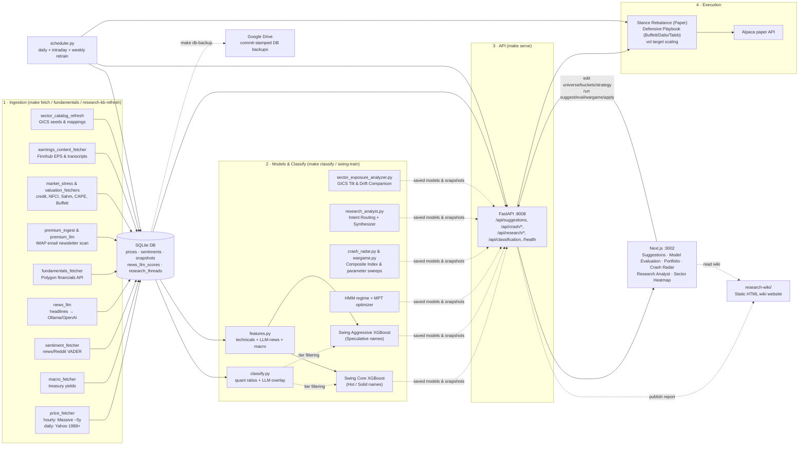

# Ampytech Trader — Documentation

This folder documents **what the bot actually does today**, derived by reading the code and inspecting
the live SQLite database. It reflects the current system, not the original design intent (those original
explorations are preserved at the bottom for history).

> **TL;DR for the developer.** A local, single-user ML trading bot. The pipeline runs end-to-end:
> ingest prices/macro/sentiment + **LLM-scored news** → engineer features → train models → produce
> **per-stock strategy suggestions** → execute on **Alpaca paper** behind a real/sim toggle, with a
> scheduler for daily + intraday cycles.
>
> The honest state after rigorous out-of-sample evaluation (see
> [strategy-evaluation-findings.md](./strategy-evaluation-findings.md)):
> - The **Swing + News** strategy (daily, LLM-news-driven) shows an edge in bull markets but
>   **amplifies bear drawdowns** (−25% in 2022 OOS) — risk-adjusted it's only ~market-level once a bear
>   is in the test window.
> - The **Long-term MPT** book is more bear-resilient but its absolute backtest returns are
>   **survivorship-inflated**.
> - The pragmatic stance the bot now defaults to: an **MPT-leaning blend**, with a per-stock
>   **strategy suggester** (validated to lift OOS Sharpe) and a **regime overlay** that auto-shrinks
>   swing in defensive regimes.
>
> The legacy **hourly short-term** model is net-negative and kept only for comparison.

---

## Document map

| Doc | What it covers |
| :-- | :-- |
| [architecture.md](./architecture.md) | Components, 7-tab frontend, processes (API / scheduler / servers), data flows, **Crash Radar, External Portfolio strategy (holdings-aware de_risk + war-game), Research Analyst, Sector Heatmap** |
| [data-pipeline.md](./data-pipeline.md) | Ingestion sources (prices, macro, sentiment, LLM news, insider, **stress indicators, estimates, transcripts**), DB schema (**all table groups: prices, fundamentals, signals, virtual broker, Equity Advisor, External Portfolio, research**) |
| [ml-and-strategy.md](./ml-and-strategy.md) | Features, strategies (swing+news, long-term MPT, HMM, **Composite Crash Index, Research Analyst, Sector Simulator**), suggester, evaluation harness |
| [execution-and-simulation.md](./execution-and-simulation.md) | Alpaca paper execution, capital buckets, regime overlay, re-execution, virtual broker, **defensive playbook stances** |
| [api-reference.md](./api-reference.md) | Every FastAPI endpoint and what it returns (including **/api/crash/\***, **/api/research/\***, **/api/equity/\*** (Equity Advisor), **/api/external/\*** (war-game + policy-compare), and **/api/portfolio/sector-exposure**) |
| [operations.md](./operations.md) | Setup, Makefile/CLI (with **Research KB & sector commands**), scheduler jobs, model retraining, DB backups |
| [research-methodology.md](./research-methodology.md) | **RKB & GICS screens.** snapshot materialization, relative multi-factor ranks, earnings depth, internal 12m targets, structured RAG |
| [strategy-evaluation-findings.md](./strategy-evaluation-findings.md) | **Honest OOS results.** The 2022-bear test, swing-as-bull-amplifier, MPT survivorship, the blend |
| [strategy-suggester-plan.md](./strategy-suggester-plan.md) | The per-ticker suggester design (v1 + self-validation + v2 regime overlay), all shipped |
| [current-state-and-gaps.md](./current-state-and-gaps.md) | **Read this.** What's real vs. weak, known caveats, and the honest roadmap |
| [equity-advisor-plan.md](./equity-advisor-plan.md) | *Original* Equity Advisor design plan (shipped; see api-reference.md §Equity Advisor for current endpoints) |
| [stock_trader_design.md](./stock_trader_design.md) | *Original* architecture exploration (pre-build design intent) |
| [implementation_plan.md](./implementation_plan.md) | *Original* staged build plan (pre-build design intent) |

---

## The system in one diagram

---

## Glossary

- **Universe** — Tickers the models evaluate. Stored in `universe_tickers` (each with a per-ticker `strategy`); editable in the UI Portfolio tab.
- **Risk × Quality Tiers** — The four-tier classification grid defined in `classify.py` that decides stock routing:
  - **Hot (quality_growth)** — Strong fundamentals, high volatility. Driven by the Core swing model (accumulate dips).
  - **Solid (core)** — Solid fundamentals, lower volatility. Driven by the Core swing model (core holdings).
  - **Long-shot (speculative)** — Weak fundamentals, high volatility. Routed to the **high-risk sleeve** using Aggressive swing model signals.
  - **Cold (value_trap)** — Weak fundamentals, low volatility. Excluded from all active trading (avoided).
- **Two-Model Swing Setup** — The split model execution path:
  - **Core Swing Model** — XGBoost trained only on Hot, Solid, and Unrated tickers.
  - **Aggressive Swing Model** — XGBoost trained on all tickers, used to generate suggestions for speculative Long-shot names.
- **High-Risk Sleeve** — Capital allocation sleeve restricted to speculative Long-shot names under the aggressive model, capped at 5% of total equity (`HIGH_RISK_CAP`).
- **Volatility Sizing** — Dynamic position scaling factor `min(1.0, SWING_VOL_TARGET / name_vol)` based on the stock's trailing volatility to cap absolute risk.
- **Manual Overrides (`tier_override`)** — Database flag in `ticker_classification` allowing direct user placement of any ticker into a specific tier, bypassing computed models.
- **Long-term MPT** — Regime-aware max-Sharpe portfolio weights (the "rebalance" book).
- **Short-term** — The legacy hourly XGBoost breakout signal; **net-negative**, kept for comparison only.
- **Strategy suggester** — Per-ticker recommender (swing / longterm / hold) with a self-validation step.
- **Capital buckets** — User-set % of equity per strategy (`app_settings`); execution never exceeds them.
- **Regime overlay** — Auto-shrinks the swing bucket in `transition`/`crisis` HMM regimes.
- **Regime** — `growth` / `transition` / `crisis`, from a 3-state HMM on daily SPY volatility + macro.
- **Mode (`real` vs `simulated`/`replay`)** — Two isolated virtual accounts; `real` mirrors the Alpaca paper book.
- **Look-ahead-free / OOS** — Walk-forward evaluation where models only see data before the test date; LLM-news features are shifted +1 day (point-in-time).
- **Research Thread** — Conversation logs with the AI research analyst, capturing intent, query context, and generated reports.
- **Sector Heatmap** — Visually color-coded dashboard grid detailing portfolio weight drift vs. the S&P 500 GICS sector weights.
- **Drift Alert** — Automated notification when a sector allocation drifts by $\ge 5\text{pp}$ vs the S&P 500 benchmark.
- **GICS Norm** — Standard GICS sector and industry classifications mapping via `research_sectors.json`.
- **Consolidated Holdings** — Sum of trading account assets plus external brokerage tax lot statements.
