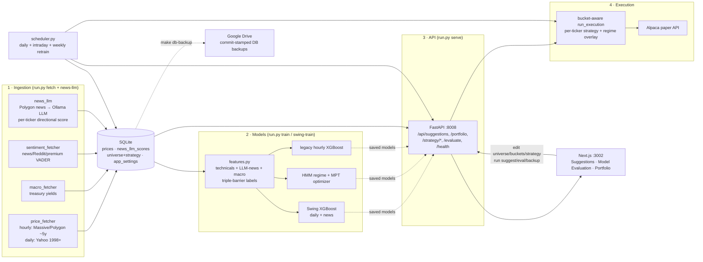

# Ampytech Trader — Documentation

This folder documents **what the bot actually does today**, derived by reading the code and inspecting
the live SQLite database. It reflects the current system, not the original design intent (those original
explorations are preserved at the bottom for history).

> **TL;DR for the developer.** A local, single-user ML trading bot. The pipeline runs end-to-end:
> ingest prices/macro/sentiment + **LLM-scored news** → engineer features → train models → produce
> **per-stock strategy suggestions** → execute on **Alpaca paper** behind a real/sim toggle, with a
> scheduler for daily + intraday cycles.
>
> The honest state after rigorous out-of-sample evaluation (see
> [strategy-evaluation-findings.md](./strategy-evaluation-findings.md)):
> - The **Swing + News** strategy (daily, LLM-news-driven) shows an edge in bull markets but
>   **amplifies bear drawdowns** (−25% in 2022 OOS) — risk-adjusted it's only ~market-level once a bear
>   is in the test window.
> - The **Long-term MPT** book is more bear-resilient but its absolute backtest returns are
>   **survivorship-inflated**.
> - The pragmatic stance the bot now defaults to: an **MPT-leaning blend**, with a per-stock
>   **strategy suggester** (validated to lift OOS Sharpe) and a **regime overlay** that auto-shrinks
>   swing in defensive regimes.
>
> The legacy **hourly short-term** model is net-negative and kept only for comparison.

---

## Document map

| Doc | What it covers |
| :-- | :-- |
| [architecture.md](./architecture.md) | Components, processes (API / scheduler / servers), data flows, deployment |
| [data-pipeline.md](./data-pipeline.md) | Ingestion sources (prices, macro, sentiment, LLM news, insider), the DB schema (ERD) |
| [ml-and-strategy.md](./ml-and-strategy.md) | Features, the strategies (swing+news, long-term MPT, regime HMM, legacy short-term), the suggester, the evaluation harness |
| [execution-and-simulation.md](./execution-and-simulation.md) | Alpaca paper execution, capital buckets, regime overlay, intraday re-execution, liquidation, virtual broker, sim/replay |
| [api-reference.md](./api-reference.md) | Every FastAPI endpoint and what it returns |
| [operations.md](./operations.md) | Setup, Makefile/CLI, the scheduler jobs, model retraining, Google-Drive DB backup runbook |
| [strategy-evaluation-findings.md](./strategy-evaluation-findings.md) | **Honest OOS results.** The 2022-bear test, swing-as-bull-amplifier, MPT survivorship, the blend |
| [strategy-suggester-plan.md](./strategy-suggester-plan.md) | The per-ticker suggester design (v1 + self-validation + v2 regime overlay), all shipped |
| [current-state-and-gaps.md](./current-state-and-gaps.md) | **Read this.** What's real vs. weak, known caveats, and the honest roadmap |
| [stock_trader_design.md](./stock_trader_design.md) | *Original* architecture exploration (pre-build design intent) |
| [implementation_plan.md](./implementation_plan.md) | *Original* staged build plan (pre-build design intent) |

---

## The system in one diagram

---

## Glossary

- **Universe** — tickers the models evaluate. Stored in `universe_tickers` (each with a per-ticker
  `strategy`); editable in the UI Portfolio tab.
- **Swing + News** — the daily, multi-day strategy whose key feature is **LLM-scored news**; the
  validated (in bull regimes) edge and the default tradeable strategy.
- **Long-term MPT** — regime-aware max-Sharpe portfolio weights (the "rebalance" book).
- **Short-term** — the legacy hourly XGBoost breakout signal; **net-negative**, kept for comparison only.
- **Strategy suggester** — per-ticker recommender (swing / longterm / hold) with a self-validation step.
- **Capital buckets** — user-set % of equity per strategy (`app_settings`); execution never exceeds them.
- **Regime overlay** — auto-shrinks the swing bucket in `transition`/`crisis` HMM regimes.
- **Regime** — `growth` / `transition` / `crisis`, from a 3-state HMM on daily SPY volatility + macro.
- **Mode (`real` vs `simulated`/`replay`)** — two isolated virtual accounts; `real` mirrors the Alpaca
  paper book.
- **Look-ahead-free / OOS** — walk-forward evaluation where models only see data before the test date;
  LLM-news features are shifted +1 day (point-in-time).
