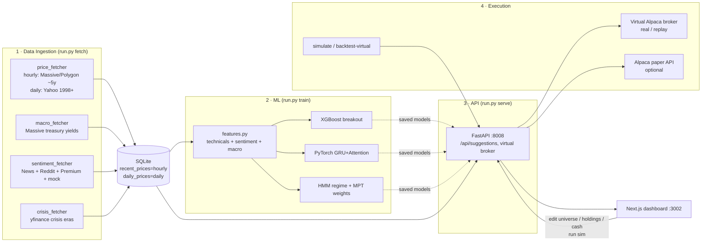

# Ampytech Trader — Documentation

This folder documents **what the bot actually does today**, derived by reading the code and
inspecting the live SQLite database — not what it was originally meant to do. Where the running
system diverges from the original design or the product README, that is called out explicitly.

> **TL;DR for the developer:** The plumbing (ingestion → features → models → suggestions →
> virtual broker → dashboard) is fully wired and runs end-to-end. But several correctness and
> data-quality issues (chiefly **mixed daily/hourly price data fed into daily-semantics features**,
> and **mostly-mock sentiment**) mean the *signal* the bot produces is currently **not trustworthy**.
> Start with [current-state-and-gaps.md](./current-state-and-gaps.md).

---

## Document map

| Doc | What it covers |
| :-- | :-- |
| [architecture.md](./architecture.md) | System components, processes, deployment, end-to-end request/data flows |
| [data-pipeline.md](./data-pipeline.md) | Ingestion sources, the "Massive" API, DB schema (ERD), caching/rate-limiting |
| [ml-and-strategy.md](./ml-and-strategy.md) | Feature engineering, the 3 models, how short- & long-term suggestions are produced |
| [execution-and-simulation.md](./execution-and-simulation.md) | Virtual broker, real vs. replay modes, forward sim, historical replay, Alpaca executor, sizing |
| [api-reference.md](./api-reference.md) | Every FastAPI endpoint and what it returns |
| [operations.md](./operations.md) | Setup, CLI/Makefile, scheduler, day-to-day runbook |
| [current-state-and-gaps.md](./current-state-and-gaps.md) | **Read this.** What's real vs. mock, known bugs/discrepancies, and a prioritized roadmap to "trustworthy" |
| [strategy-evaluation-findings.md](./strategy-evaluation-findings.md) | **Honest OOS results.** Swing is a bull amplifier (−25% in 2022); MPT resilient but survivorship-inflated; blend is most defensible |
| [strategy-suggester-plan.md](./strategy-suggester-plan.md) | *Plan (not built).* Evidence-driven per-ticker Swing-vs-MPT-vs-Hold recommender for the Portfolio tab |
| [stock_trader_design.md](./stock_trader_design.md) | *Original* architecture exploration (design intent, pre-build) |
| [implementation_plan.md](./implementation_plan.md) | *Original* staged build plan (design intent, pre-build) |

---

## What the bot is, in one diagram

---

## Glossary

- **Universe** — the set of tickers the models evaluate. Seeded from `config.py:TICKER_UNIVERSE`,
  editable in the UI, stored in `universe_tickers`.
- **Short-term signal** — per-ticker BUY/SELL/HOLD from the breakout classifier (XGBoost or PyTorch).
- **Long-term allocation** — portfolio weights from HMM regime → MPT (Sharpe-max) optimizer.
- **Regime** — `growth` / `transition` / `crisis`, classified by a 3-state HMM on SPY volatility + macro.
- **Virtual broker** — an in-app mock of the Alpaca REST API (`/api/virtual_alpaca/...`) backed by SQLite.
- **Mode (`real` vs `simulated`/`replay`)** — two isolated virtual accounts. `real` = account id 2 /
  positions `mode='real'`; `replay`/simulated = account id 1 / positions `mode='replay'`. A global
  `data/sim_date.txt` file flips the server into replay-as-of-a-date while a simulation runs.
- **Look-ahead-free** — features for day *T* are shifted to use only data through *T-1*; orders fill at
  *T*'s open.
