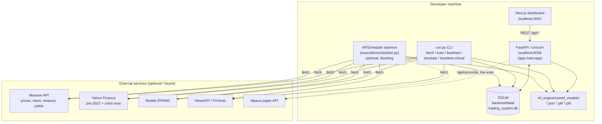
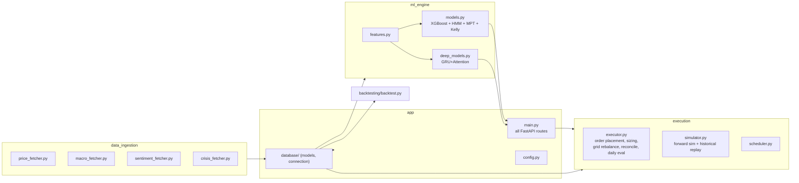
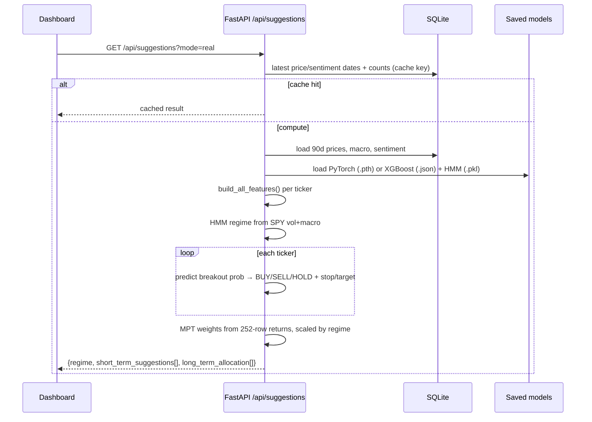
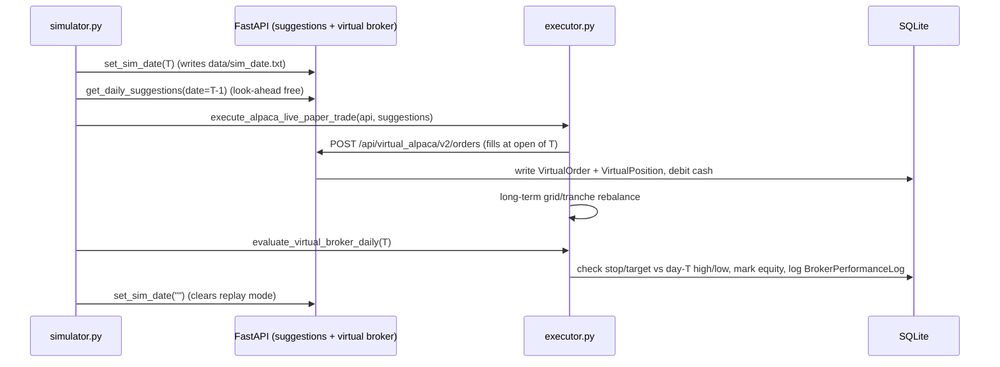

# Architecture

## 1. Processes & ports

The system is a local monorepo of independent processes that all share one SQLite file.

Key facts:
- **One SQLite DB** (`backend/data/trading_system.db`) is the single source of truth shared by every
  process. `check_same_thread=False`; FastAPI uses a per-request session.
- The backend serves **both** the data/suggestions API *and* a fake Alpaca broker under
  `/api/virtual_alpaca/v2/*`. The executor talks to that fake broker over HTTP (`localhost:8008`) using
  the real `alpaca_trade_api` client, so the same code path can later point at real Alpaca.
- Models are plain files loaded lazily by the API on each `/api/suggestions` call (with an in-memory
  result cache keyed on data state).
- The scheduler is **optional** and **not required** for the dashboard; it only matters for unattended
  daily fetch/train/execute.

## 2. Component responsibilities

| Module | Responsibility | Notes / gotchas |
| :-- | :-- | :-- |
| `data_ingestion/*` | Pull prices, macro, sentiment, crisis data into SQLite | Sources differ from README (see [data-pipeline.md](./data-pipeline.md)) |
| `ml_engine/features.py` | Build all features for one ticker + cross-ticker features | Computes stationary technical indicator ratios and Parkinson Volatility |
| `ml_engine/models.py` | Train XGBoost + HMM; MPT optimizer; Kelly sizing | MPT = SciPy SLSQP Solver maximizing Sharpe under dynamic constraints |
| `ml_engine/deep_models.py` | Train GRU+Self-Attention sequence classifier | Fully integrated sequence predictor (seq_len=10) |
| `app/main.py` | **Every** API route incl. suggestions + virtual broker | 1,150 lines; also computes suggestions inline |
| `execution/executor.py` | Sizing, bracket orders, long-term grid, Alpaca reconcile, daily stop eval | Talks to virtual broker over HTTP |
| `execution/simulator.py` | Forward sim & day-by-day historical replay | Drives executor; toggles global `sim_date.txt` |
| `backtesting/backtest.py` | PyBroker short-term backtest + manual MPT backtest | Separate from virtual-broker replay |
| `execution/scheduler.py` | APScheduler cron for daily fetch/infer/execute + weekly retrain | Optional daemon |

## 3. End-to-end: how a suggestion is produced

Thresholds (in `app/main.py`): **BUY if prob ≥ 0.15**, **SELL if prob ≤ 0.02**, else HOLD (config-driven).
Stop-loss = `clip(2·ATR/close, 1.5%, 5%)`, take-profit = `2.5 × stop`.

## 4. Execution / simulation flow

> **Concurrency caveat:** `sim_date.txt` is a **global** server flag. While a simulation/replay runs,
> the live dashboard's broker endpoints also switch into replay-as-of-T for everyone hitting the server.
> See [execution-and-simulation.md](./execution-and-simulation.md).
