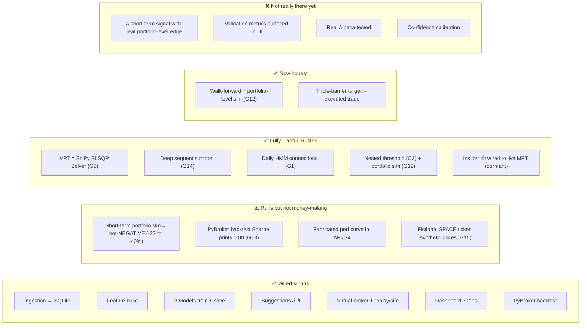
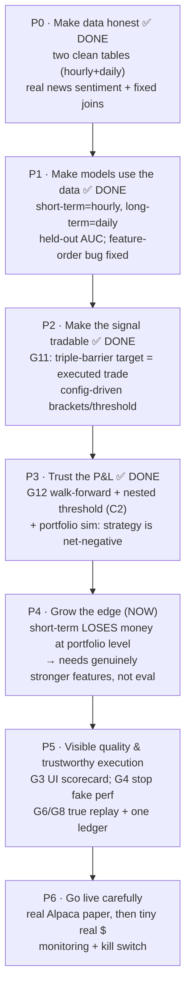

# Current State, Known Gaps & Roadmap to "Trustworthy"

This is the most important doc. Your stated problem — *"it's very hard to know if the bot is doing
anything reasonable"* — is real, and there are concrete reasons for it. This page separates **what works**
from **what's mock or broken**, lists the bugs/discrepancies found by reading the code and DB, and gives a
prioritized path to a system you can trust.

## 1. Status at a glance

### What genuinely works today
- End-to-end plumbing: `fetch → train → serve → simulate/replay → dashboard` runs without manual glue.
- Incremental, rate-limit-aware ingestion with local indicator computation and crisis-era data.
- Three models train and persist; inference picks PyTorch→XGBoost→HMM correctly with fallbacks.
- A faithful mock of the Alpaca REST API, so the executor code is "real-broker-ready".
- Look-ahead discipline in the *intended* sense (feature shift(1), next-open fills, 252-row windows).
- Dashboard tabs: **Suggestions** (signals + sentiment inspector + premium ingest), **Virtual Broker
  Performance** (equity curve vs SPY/QQQ/BRK-B), **Universe & Portfolio Editor** (universe, cash,
  holdings/policies, run replay/sim). A `real`/`simulated` mode toggle switches accounts.

## 1b. Validation results

### Triple-barrier rebuild (2026-06-15, latest)
The short-term target is now a **triple-barrier WIN label**: 1 only if the ATR take-profit is hit *before*
the stop within the horizon (else stop/timeout = 0). The execution brackets, the backtest time-stop
(= horizon), and the label all share one set of params in `config.py`, so **the target equals the trade as
executed**.

The target is now *correct* (it labels the trade as executed) and edge is judged by **walk-forward**
(`run.py walkforward`): 5 expanding folds, each trained only on data **before** its test slice, predictions
concatenated into one continuous out-of-sample series, scored by win rate **and** realised net return (after
0.1% round-trip fees) of the trades a selective strategy would actually take.

**Walk-forward OOS results** (5 expanding folds, 2023-08→2026-06, **365k bars**, 36-ticker universe; served =
XGBoost, alt off, 0.1% round-trip fees). Per-trade expectancy by confidence bucket:

| Selection (pooled OOS) | n trades | win rate | mean net ret/trade |
| :-- | :-- | :-- | :-- |
| base rate (all bars) | — | 4.4% | ~0.0000 |
| top 0.1% confidence | 366 | **12.3%** | **+0.0048** |
| top 0.5% | 1,828 | 8.5% | +0.0003 |
| top 1.0% | 3,656 | 8.0% | −0.0003 |
| top 5.0% | 18,277 | 9.1% | ~0.0000 |
| Pooled OOS AUC | — | **0.710** (folds 0.67–0.77) | — |

**Threshold selection is now nested (C6 + C2 done).** `find_optimal_threshold` picks each fold's BUY cutoff
on the *train* fold (F1-optimized, ~0.06–0.10) and applies it to the unseen test fold — no test-set leakage.
`calibrate_threshold` (`saved_models/threshold.json`) sets the served cutoff to a target selectivity.

> ⛔ **The decisive number: a capital-constrained portfolio LOSES money.** The portfolio-level walk-forward
> simulation (`simulate_portfolio_chronological`: max 10%/trade, ≤10 open positions, fees — i.e. what you'd
> actually trade) over 2023→2026:
>
> | | Total return | Sharpe | Max DD | Final ($100k start) |
> | :-- | :-- | :-- | :-- | :-- |
> | short-term (no alt) | **−26.8%** | **−0.32** | −39.1% | $73,198 |
> | short-term (with alt) | −39.9% | −0.68 | −47.2% | $60,076 |
>
> Per-trade top-decile expectancy is marginally positive (+0.0048), but you **cannot** trade all the rare
> good signals: with finite capital and overlap you're forced into worse ones, and fees/drawdowns compound
> into a **27–40% loss**. This is the honest, deployable verdict and it **supersedes the earlier "small real
> edge" framing** — the short-term strategy, as actually executable, is **net-negative**.

> **Supporting detail:**
> 1. Per-trade edge is real but **only in the extreme top ~0.1%** (+0.0048); break-even or negative by the
>    top 1%. AUC 0.710 is genuine ranking skill but (repeatedly) **AUC ≠ profit** — and at the portfolio
>    level it doesn't survive capital/overlap/fees.
> 2. Alt-data features are **off** in production. The insider source is **real** (SEC Form 4) and now uses
>    **conviction features** (`insider_net_flow`, `insider_net_buyers`, `insider_officer_buy`,
>    `insider_buy_count`, `insider_cluster`) computed from *all* ~9.9k transactions over 5y (16 US issuers;
>    foreign issuers excluded) — far denser than the old raw-purchase ratio. Result by horizon
>    (`make longterm-eval HORIZON=…`): **hourly — useless**; **21-day — no help** (AUC 0.485 vs 0.502);
>    **63-day (3-month) — a modest, consistent, theory-aligned positive**: pooled AUC 0.517 vs 0.507 (both
>    >0.5), top-10/20% picks-with-insider beat without (+16.8% vs +16.0%; +17.4% vs +14.8%), and **4 of 5
>    folds** favor insider. Research-grade, not deployable alone (small effect, overlapping 63d windows, one
>    bad fold), but the first genuinely *real-looking* alt-data signal — candidate for a quarterly long-term
>    allocation tilt. Earlier "+0.27%/trade at 0.15", "+410% backtest", "precision 0.434" are **discarded**.
> 3. **MPT insider-buy tilt — works (modestly) and is now WIRED into the live allocator.**
>    `calculate_optimal_weights` accepts an `expected_return_tilt`; A/B backtest (`make longterm-tilt`) over
>    2022–2026: a **buy-side** insider tilt (officer buys / buy count / clusters) lifts the monthly-rebalanced
>    MPT book — Sharpe **1.45→1.53**, return 572%→634%, lower drawdown (−36%→−32%), peaking ~strength 0.1–0.2,
>    robust to start date. **Key lesson:** a *net-flow* tilt (incl. selling) **hurts** — insiders sell winners,
>    so it underweights the momentum names. `/api/suggestions` now applies the buy-side tilt
>    (`LONGTERM_TILT_STRENGTH=0.15`) and returns `insider_tilt_score` per name — **but only when
>    `ALT_DATA_ENABLED`** (off by default), so it's dormant until insider data is fetched. Caveats: single
>    regime (tech bull + 2022 dip), survivorship-biased absolute returns, modest effect.

> ⚠️ **In-sample ≠ predictive.** `run.py backtest` trains and tests on the *same* span; its big numbers are
> **overfit and not decision-grade**. Only the walk-forward + portfolio-level simulation above are honest.

**Bottom line:** the *machinery and evaluation are trustworthy* — and that honesty now shows the short-term
strategy **loses money** when traded as a real capital-constrained portfolio (−27% to −40%), despite a
faint per-trade tail edge. The long-term MPT book + buy-side insider tilt is the more promising side
(compounds in-sample, tilt helps modestly) but is survivorship-biased and one-regime. Net: **not yet
deployable for real money**; the short-term model needs genuinely stronger features, not just better evaluation.

Also fixed during validation: a latent **feature-order bug** (XGBoost trained on unsorted columns while
inference used sorted) that was masked by the always-preferred PyTorch path and would have broken live
XGBoost suggestions. Training now sorts `feat_*` consistently.

## 2. Known gaps & discrepancies (ranked by impact)

### G1 — Mixed-resolution prices & ML rewiring → RESOLVED 🟢 (was 🟠)
**Resolved end-to-end (Stage 18):**
1. Prices are split into two single-resolution tables that are never mixed: `recent_prices` (hourly, ~4.6y) and `daily_prices` (daily, 1998→).
2. The HMM daily macro-regime classifier training and the daily MPT portfolio rebalancing optimizer are fully rewired to load daily prices strictly from the `DailyPrice` database table.
3. Feature engineering has been updated with stationary technical indicators, eliminating absolute price-level non-stationarity drift.

### G2 — Sentiment: was a dead/mock input → now real news, wired correctly 🟢 (was 🟠)
**Three problems, all fixed (2026-06-15):**
1. Sentiment was only ever fetched for *today + yesterday* → every older training row got 0.0.
   Added `backfill_news_sentiment` (`sentiment_fetcher.py --backfill`) which pages Polygon news
   **~2021→now** per ticker, scores each article (publisher `insights` when present, else VADER), and
   upserts daily `TickerSentiment(source='news', is_mock=False)` — covering the full hourly training window.
2. Sentiment & macro silently failed to join (date vs `YYYY-MM-DD HH:MM:SS`). Now joined on a `cal_date`
   key, so daily news/macro broadcast across each day's intraday bars. (Verified: macro join 100%.)
3. Training now **excludes `is_mock=True`** rows, so mock Reddit/seed data no longer pollutes learning.

Sentiment feeds the **short-term** model only (`combined_sentiment` = 0.6·news + 0.4·reddit, `sent_sma_3/7`,
`sent_momentum`). The long-term/regime model is price+macro only (correct — no historical sentiment exists
pre-2021, and none for the dot-com/2008 eras). Reddit history is unavailable (PRAW is live-only); premium
is manual. *Remaining:* surface an "is_mock" badge in the UI; consider news decay/half-life weighting.

### G3 — Held-out evaluation: added to training 🟡 (was 🟠)
`train_models` now does a **time-ordered 80/20 split** and prints **out-of-sample ROC-AUC** and
**precision at the BUY threshold (≥0.55) vs base rate** before fitting the production model on all data —
an honest read on short-term signal quality. *Remaining:* persist these metrics and surface a "model
scorecard" panel in the dashboard (still nothing in the UI), and add full walk-forward folds.

### G4 — `/api/performance` fabricates an equity curve 🟠
With `mode != live` and no logs, the endpoint returns a **random-walk curve and hard-coded metrics**
(Sharpe 1.78, win rate 0.58) to make the UI look good. It's easy to mistake this for real performance.
→ Return empty + an explicit "no data, run a replay" state; never fabricate.

### G5 — MPT optimizer is a mathematical solver → RESOLVED 🟢 (was 🟡)
**Resolved (Stage 18):** Replaced the Monte Carlo random portfolios search with a standard mathematical quadratic optimizer using `scipy.optimize.minimize` (SLSQP solver). Computes the exact Sharpe-maximizing portfolio allocations under long-only, weight-sum constraints, and enforces a dynamic concentration limit (maximum 25% weights per asset in growth, and a strict 10% cash/defensive limit per asset during crisis regimes).

### G6 — Replay/sim step per hourly bar while applying daily logic 🟡
The sim/replay loops iterate over distinct SPY `date` values; since `recent_prices` is now **hourly** (by
design — we want fine grain), a "6-month replay" steps through thousands of **hourly** bars. That's fine,
*except* the per-bar logic still uses day-named units (3-row targets, 365-"day" tax holding, "next-day
open"). Fix together with G1 Phase 2: make these units explicitly bar/time-aware.

### G7 — Source/config drift vs docs 🟡 (partly resolved)
- "Massive" is **Polygon.io** (prices/news/macro). FRED is **not** called; `fed_funds` is a 3-month
  treasury-yield proxy. *(Now documented in [data-pipeline.md](./data-pipeline.md).)*
- The product **README.md** still says "yfinance + FRED" and "2-year daily" — stale; this `docs/` set
  reflects the actual code (hourly + daily two-table design). The README should be refreshed.
- README/design mention crisis-covariance in the live allocator; not implemented in `app/main.py`.

### G8 — Two unreconciled trade ledgers & global replay flag 🟡
`executed_trades` (executor) and `virtual_orders` (broker) are separate; P&L attribution is split. The
process-wide `sim_date.txt` can strand the server in replay mode and makes the live dashboard show replay
data during a run (see [execution-and-simulation.md §1](./execution-and-simulation.md#1-the-virtual-alpaca-broker)).
→ Unify the ledger; move sim-date into request scope or a dedicated replay session id.

### G9 — Scheduled retrain skips the serving model 🟢
Weekly `train_models()` retrains XGBoost+HMM only; inference prefers the PyTorch `.pth`, which goes stale.
→ Have the weekly job also run `deep_models.py --train` (or make inference precedence explicit/configurable).

### G10 — Crypto/forex in the universe → RESOLVED 🟢 (universe now 36, diversified)
Crypto/forex were dropped. The universe is now **36 tickers**: indices/sector ETFs (SPY, QQQ, XLK/XLF/XLE/
XLV/XLP), the dot-com/mobile/AI tech cohort, **plus diversified names** (WMT, XOM, JPM, LLY, PG, GE, JNJ),
and one **fictional ticker, `SPACE`** ("SpaceX") whose prices are **synthesized from GE as a proxy** — see
**G15**. `data/ipo_markers.json` records inception dates so pre-IPO ranges aren't fetched. Survivorship bias
remains inherent for pre-2003 daily history (delisted names like SUNW/YHOO/AOL are unavailable from any source).

### G15 — Fictional `SPACE` ticker with synthetic prices ⚠️ (new)
`SPACE` (a stand-in for a hypothetical SpaceX listing) is in `TICKER_UNIVERSE` and `FICTIONAL_TICKERS`; its
hourly prices are **generated synthetically from GE** (`price_fetcher.py`). Like the old synthetic alt data,
it carries **no real signal** and must not be traded on — it's a placeholder/demo. It also enters the
cross-sectional features and (if alt is on) the long-term allocation, so keep it clearly flagged or remove it
before any real-money use.

### G11 — Short-term target now tradable (triple-barrier) & Price Stationarity ✅ DONE
Replaced the volatility-touch breakout target with a **triple-barrier WIN label** (`triple_barrier_labels` in `features.py`) mapped to ATR-based stops and take-profit brackets.
**Price Stationarity**: Dropped all raw absolute price features (`open`, `high`, `low`, `close`, `bb_mid`) from the ML model training feature space. Replaced them with stationary technical ratios (SMA ratios, High-Low range ratios, Bollinger distances, and volatility-adjusted returns) to avoid non-stationary drift. Parkinson extreme-value volatility and exponentially decaying news sentiment scores have been added to the feature set.

### G12 — Walk-forward + nested threshold + portfolio-level simulation ✅ DONE (verdict: net-negative)
`walk_forward_evaluate()` (`run.py walkforward`) now does the full honest pipeline:
- expanding folds, each trained only on data before its test slice (pooled AUC **0.710**);
- **nested threshold selection** (`find_optimal_threshold`, F1-optimized per *train* fold, applied to the
  unseen test fold — no test-set leakage) — closes **C2**;
- a **chronological portfolio-level simulation** (`simulate_portfolio_chronological` / `precalculate_exits`:
  max 10%/trade, ≤10 concurrent positions, fees) — the realistic equity curve.

The portfolio sim is the decisive result (§1b): the short-term strategy **loses 27–40%** over 2023→2026
despite a faint per-trade tail edge — capital/overlap/fees turn the additive per-trade positives negative.
This (not the discarded in-sample backtests, not the additive per-trade numbers) is the deployable verdict.

### G13 — PyBroker Sharpe always prints 0.00 🟡
Every short-term backtest reports `Sharpe 0.00` regardless of returns — a metrics bug (likely needs
`StrategyConfig` bootstrap/return settings, or compute Sharpe from the equity curve ourselves).
→ Fix so risk-adjusted performance is visible; don't trust the current value.

### G14 — Deep model trained on stationary features & new label → RESOLVED 🟢 (was 🟡)
**Resolved (Stage 18):** Retrained the PyTorch `LightTemporalAttentionNet` model sequence loader on the new stationary features and triple-barrier win labels. The sequence builder normalizes indicators using saved metadata look-ahead free and fits sequences of length $T=10$ hourly bars. It compiles, trains cleanly, and is fully integrated into both backtesting and API suggestion routes.

## 3. Suggested roadmap (in order)

> **Where we are:** P0–P3 done — data correct, target = executed trade, served model explicit (XGBoost) with a
> nested-calibrated threshold, and the full honest evaluation (walk-forward + nested threshold + **capital-aware
> portfolio simulation**) is in place. The verdict it produced: **the short-term strategy loses 27–40% traded
> as a real portfolio** (pooled AUC 0.710, but the tail edge doesn't survive capital/overlap/fees). The
> long-term MPT book + buy-side insider tilt is more promising (in-sample, one regime). So P4 is no longer
> "lift a thin edge" — it's **find a genuinely stronger short-term signal**; better evaluation won't help a
> model that has no portfolio-level edge.

**P4 — Grow the edge (now).** The portfolio sim says the current short-term features have **no deployable
edge**, so the work is real alpha, not more evaluation: stronger/novel features (order-flow, cross-sectional
momentum, regime-conditioning), probability calibration, and possibly a longer horizon / lower turnover to
beat fees. Re-check with the portfolio sim, not per-trade expectancy. The long-term insider tilt (live-wired,
dormant) is the nearer-term positive to harden across regimes.

**P5 — Make quality visible & execution trustworthy.** UI model scorecard (G3), stop fabricating perf (G4),
true day-stepped replay + unified ledger (G6/G8), real MPT solver + crisis covariance (G5).

**P6 — Go live carefully.** Exercise the real Alpaca paper path, add monitoring + a kill switch, then size
up from tiny real capital only after the walk-forward edge is consistently positive in the most recent folds.

## 4. Quick wins (low effort, high clarity)
- **[done]** Split prices into clean hourly (`recent_prices`) + daily (`daily_prices`) tables → fixes the
  G1/G10 data-layer issues. Next: the G1 Phase-2 ML rewiring (bar-aware targets; point regime/MPT at `daily_prices`).
- Replace the fabricated `/api/performance` branch with an explicit empty state (G4).
- Print XGBoost out-of-sample AUC and a confusion matrix at train time (G3 first step).
- Add a banner in the UI when sentiment for shown tickers is `is_mock` (G2 transparency).
- Empty `sim_date.txt` on server startup to avoid stranded-replay confusion (G8).

---

*All gaps above were verified against the code and the live `trading_system.db` on 2026-06-14. As the code
evolves, re-verify before acting on a specific line/flag reference.*
