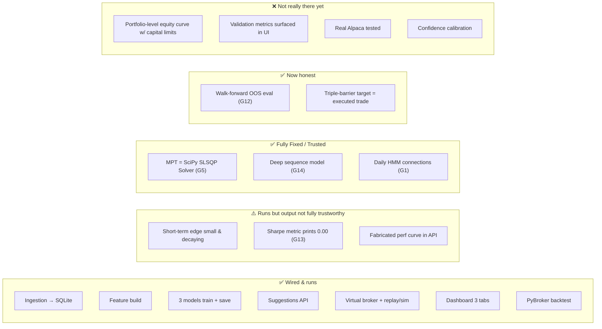
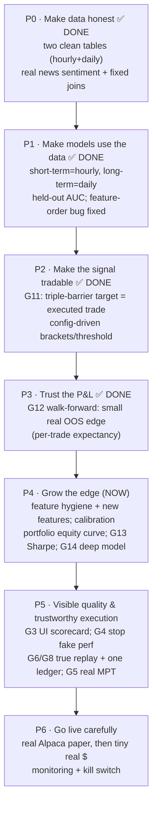

# Current State, Known Gaps & Roadmap to "Trustworthy"

This is the most important doc. Your stated problem — *"it's very hard to know if the bot is doing
anything reasonable"* — is real, and there are concrete reasons for it. This page separates **what works**
from **what's mock or broken**, lists the bugs/discrepancies found by reading the code and DB, and gives a
prioritized path to a system you can trust.

## 1. Status at a glance

### What genuinely works today
- End-to-end plumbing: `fetch → train → serve → simulate/replay → dashboard` runs without manual glue.
- Incremental, rate-limit-aware ingestion with local indicator computation and crisis-era data.
- Three models train and persist; inference picks PyTorch→XGBoost→HMM correctly with fallbacks.
- A faithful mock of the Alpaca REST API, so the executor code is "real-broker-ready".
- Look-ahead discipline in the *intended* sense (feature shift(1), next-open fills, 252-row windows).
- Dashboard tabs: **Suggestions** (signals + sentiment inspector + premium ingest), **Virtual Broker
  Performance** (equity curve vs SPY/QQQ/BRK-B), **Universe & Portfolio Editor** (universe, cash,
  holdings/policies, run replay/sim). A `real`/`simulated` mode toggle switches accounts.

## 1b. Validation results

### Triple-barrier rebuild (2026-06-15, latest)
The short-term target is now a **triple-barrier WIN label**: 1 only if the ATR take-profit is hit *before*
the stop within the horizon (else stop/timeout = 0). The execution brackets, the backtest time-stop
(= horizon), and the label all share one set of params in `config.py`, so **the target equals the trade as
executed**.

The target is now *correct* (it labels the trade as executed) and edge is judged by **walk-forward**
(`run.py walkforward`): 5 expanding folds, each trained only on data **before** its test slice, predictions
concatenated into one continuous out-of-sample series, scored by win rate **and** realised net return (after
0.1% round-trip fees) of the trades a selective strategy would actually take.

**Walk-forward OOS results** (5 expanding folds, 2023-08→2026-06, 297k bars; served = XGBoost, alt off,
0.1% round-trip fees). These are the **only decision-grade numbers** — pooled over all folds:

| Selection (pooled OOS) | n trades | win rate | mean net ret/trade |
| :-- | :-- | :-- | :-- |
| base rate (all bars) | — | 4.9% | ~0.0000 |
| top 0.1% confidence | 298 | **14.4%** | **+0.0049** |
| top 0.5% (≈ live calibrated cut) | 1,489 | 9.9% | +0.0002 |
| top 1.0% | 2,978 | 7.4% | −0.0006 |
| top 5.0% | 14,886 | 9.4% | +0.0001 |
| Pooled OOS AUC | — | **0.698** (folds 0.66–0.76) | — |

**Live BUY threshold is now calibrated, not hand-set** (PR#2 review C6). `calibrate_threshold` writes
`saved_models/threshold.json` for the served model at a fixed target selectivity (`SHORT_TERM_SIGNAL_RATE`,
default top 0.5%). Latest: **threshold 0.1335**, single-holdout 481 signals, win **9.1%** (base 5.5%),
**+0.0016/trade net**.

> **Honest read (supersedes earlier rosier prose):**
> 1. The edge is **real but extremely thin and concentrated in the extreme tail.** Only the top ~0.1% of
>    predictions clear a meaningful per-trade net (+0.0049 ≈ +0.5%/trade); by the top 1% it's already
>    ~break-even or negative. Mean net at the calibrated top-0.5% cut is ~+0.0002–0.0016 — *fractions of a
>    percent per trade*.
> 2. It is **inconsistent across folds**: per-fold top-5% net return is **negative in 4 of the 5 folds**
>    (only fold 3 ≈ 0), including the most recent (2025-11→2026-06: −0.0021). The pooled positives are
>    carried by the rare top-0.1% winners, not by a stable signal.
> 3. AUC ≈ 0.698 is genuine ranking skill, but (as repeatedly shown) **AUC ≠ tradable edge** — the money is
>    only in the very top, and even there it's small and fragile.
> 4. Alt-data features are **off**. The insider source is now **real** (SEC Form 4). On the **hourly**
>    model it's useless (with-alt AUC 0.699 vs 0.698 = noise; purchases too rare). On the **daily 1–3-month**
>    horizon (`make longterm-eval`) it's **faint, theory-consistent, but inconclusive**: the top-5% picks
>    *with* insider beat *without* at both horizons (63d: +12.7% vs +9.2%; 21d: +4.9% vs +3.2%, vs ~+11%/+4.4%
>    universe baseline), but overall AUC ≈ 0.50 and it rests on only **50 clean purchase events** — not
>    deployable. Needs deeper insider history + wider universe + better insider features (cluster buys,
>    officer-level) to confirm. Earlier "+0.27%/trade at 0.15", "+410% backtest", "precision 0.434" are
>    **stale/leaky/in-sample and discarded**.

> ⚠️ **In-sample ≠ predictive.** `run.py backtest` trains and tests on the *same* span; its big numbers
> (e.g. the +489%/+1085% short-term returns quoted in PR #2) are **overfit and not decision-grade**. Only
> the walk-forward + calibrated-holdout numbers above reflect honest out-of-sample expectation.

**Bottom line:** the machinery (data, labels, execution alignment, walk-forward eval, calibrated threshold,
explicit served model) is trustworthy. The *edge* is **marginal, very selective, and fold-inconsistent** —
not yet "high-confidence money." The work now is real alpha (features, regime-conditioning, calibration) and
a portfolio-level walk-forward equity curve with capital/overlap constraints. The long-term book compounds
(~15%/yr in-sample) but is survivorship-biased.

Also fixed during validation: a latent **feature-order bug** (XGBoost trained on unsorted columns while
inference used sorted) that was masked by the always-preferred PyTorch path and would have broken live
XGBoost suggestions. Training now sorts `feat_*` consistently.

## 2. Known gaps & discrepancies (ranked by impact)

### G1 — Mixed-resolution prices & ML rewiring → RESOLVED 🟢 (was 🟠)
**Resolved end-to-end (Stage 18):**
1. Prices are split into two single-resolution tables that are never mixed: `recent_prices` (hourly, ~4.6y) and `daily_prices` (daily, 1998→).
2. The HMM daily macro-regime classifier training and the daily MPT portfolio rebalancing optimizer are fully rewired to load daily prices strictly from the `DailyPrice` database table.
3. Feature engineering has been updated with stationary technical indicators, eliminating absolute price-level non-stationarity drift.

### G2 — Sentiment: was a dead/mock input → now real news, wired correctly 🟢 (was 🟠)
**Three problems, all fixed (2026-06-15):**
1. Sentiment was only ever fetched for *today + yesterday* → every older training row got 0.0.
   Added `backfill_news_sentiment` (`sentiment_fetcher.py --backfill`) which pages Polygon news
   **~2021→now** per ticker, scores each article (publisher `insights` when present, else VADER), and
   upserts daily `TickerSentiment(source='news', is_mock=False)` — covering the full hourly training window.
2. Sentiment & macro silently failed to join (date vs `YYYY-MM-DD HH:MM:SS`). Now joined on a `cal_date`
   key, so daily news/macro broadcast across each day's intraday bars. (Verified: macro join 100%.)
3. Training now **excludes `is_mock=True`** rows, so mock Reddit/seed data no longer pollutes learning.

Sentiment feeds the **short-term** model only (`combined_sentiment` = 0.6·news + 0.4·reddit, `sent_sma_3/7`,
`sent_momentum`). The long-term/regime model is price+macro only (correct — no historical sentiment exists
pre-2021, and none for the dot-com/2008 eras). Reddit history is unavailable (PRAW is live-only); premium
is manual. *Remaining:* surface an "is_mock" badge in the UI; consider news decay/half-life weighting.

### G3 — Held-out evaluation: added to training 🟡 (was 🟠)
`train_models` now does a **time-ordered 80/20 split** and prints **out-of-sample ROC-AUC** and
**precision at the BUY threshold (≥0.55) vs base rate** before fitting the production model on all data —
an honest read on short-term signal quality. *Remaining:* persist these metrics and surface a "model
scorecard" panel in the dashboard (still nothing in the UI), and add full walk-forward folds.

### G4 — `/api/performance` fabricates an equity curve 🟠
With `mode != live` and no logs, the endpoint returns a **random-walk curve and hard-coded metrics**
(Sharpe 1.78, win rate 0.58) to make the UI look good. It's easy to mistake this for real performance.
→ Return empty + an explicit "no data, run a replay" state; never fabricate.

### G5 — MPT optimizer is a mathematical solver → RESOLVED 🟢 (was 🟡)
**Resolved (Stage 18):** Replaced the Monte Carlo random portfolios search with a standard mathematical quadratic optimizer using `scipy.optimize.minimize` (SLSQP solver). Computes the exact Sharpe-maximizing portfolio allocations under long-only, weight-sum constraints, and enforces a dynamic concentration limit (maximum 25% weights per asset in growth, and a strict 10% cash/defensive limit per asset during crisis regimes).

### G6 — Replay/sim step per hourly bar while applying daily logic 🟡
The sim/replay loops iterate over distinct SPY `date` values; since `recent_prices` is now **hourly** (by
design — we want fine grain), a "6-month replay" steps through thousands of **hourly** bars. That's fine,
*except* the per-bar logic still uses day-named units (3-row targets, 365-"day" tax holding, "next-day
open"). Fix together with G1 Phase 2: make these units explicitly bar/time-aware.

### G7 — Source/config drift vs docs 🟡 (partly resolved)
- "Massive" is **Polygon.io** (prices/news/macro). FRED is **not** called; `fed_funds` is a 3-month
  treasury-yield proxy. *(Now documented in [data-pipeline.md](./data-pipeline.md).)*
- The product **README.md** still says "yfinance + FRED" and "2-year daily" — stale; this `docs/` set
  reflects the actual code (hourly + daily two-table design). The README should be refreshed.
- README/design mention crisis-covariance in the live allocator; not implemented in `app/main.py`.

### G8 — Two unreconciled trade ledgers & global replay flag 🟡
`executed_trades` (executor) and `virtual_orders` (broker) are separate; P&L attribution is split. The
process-wide `sim_date.txt` can strand the server in replay mode and makes the live dashboard show replay
data during a run (see [execution-and-simulation.md §1](./execution-and-simulation.md#1-the-virtual-alpaca-broker)).
→ Unify the ledger; move sim-date into request scope or a dedicated replay session id.

### G9 — Scheduled retrain skips the serving model 🟢
Weekly `train_models()` retrains XGBoost+HMM only; inference prefers the PyTorch `.pth`, which goes stale.
→ Have the weekly job also run `deep_models.py --train` (or make inference precedence explicit/configurable).

### G10 — Crypto/forex in the universe → RESOLVED 🟢
The universe was equity-only assumptions (whole shares, 365-day tax, SPY/QQQ-relative features) but
included crypto/forex tickers. **Fixed (2026-06-15):** the universe is now equities + ETFs only (28
survivors/leaders across the dot-com, mobile, and AI cohorts). Survivorship bias is inherent for the
pre-2003 daily history (delisted names like SUNW/YHOO/AOL are unavailable from any source).

### G11 — Short-term target now tradable (triple-barrier) & Price Stationarity ✅ DONE
Replaced the volatility-touch breakout target with a **triple-barrier WIN label** (`triple_barrier_labels` in `features.py`) mapped to ATR-based stops and take-profit brackets.
**Price Stationarity**: Dropped all raw absolute price features (`open`, `high`, `low`, `close`, `bb_mid`) from the ML model training feature space. Replaced them with stationary technical ratios (SMA ratios, High-Low range ratios, Bollinger distances, and volatility-adjusted returns) to avoid non-stationary drift. Parkinson extreme-value volatility and exponentially decaying news sentiment scores have been added to the feature set.

### G12 — Walk-forward out-of-sample evaluation ✅ DONE (small real edge found)
`walk_forward_evaluate()` (`run.py walkforward`): expanding folds, each trained only on data before its test
slice; pooled OOS predictions scored by win rate **and realised net return** (the labeler now emits per-trade
`trade_ret`). Result (see §1b): pooled AUC **0.698**, edge **only in the extreme top 0.1%** (+0.0049/trade);
~break-even by the top 1%, and per-fold top-5% net is **negative in 4/5 folds**. This (not the discarded
in-sample backtests) is the trustworthy read: a marginal, fragile, very-selective edge.
→ *Remaining:* a **portfolio-level walk-forward equity curve** with capital/overlap/position limits (current
metric is per-trade expectancy, additive, ignoring that signals overlap); and fold-forward nested threshold
selection (C2). These give the final honest P&L picture.

### G13 — PyBroker Sharpe always prints 0.00 🟡
Every short-term backtest reports `Sharpe 0.00` regardless of returns — a metrics bug (likely needs
`StrategyConfig` bootstrap/return settings, or compute Sharpe from the equity curve ourselves).
→ Fix so risk-adjusted performance is visible; don't trust the current value.

### G14 — Deep model trained on stationary features & new label → RESOLVED 🟢 (was 🟡)
**Resolved (Stage 18):** Retrained the PyTorch `LightTemporalAttentionNet` model sequence loader on the new stationary features and triple-barrier win labels. The sequence builder normalizes indicators using saved metadata look-ahead free and fits sequences of length $T=10$ hourly bars. It compiles, trains cleanly, and is fully integrated into both backtesting and API suggestion routes.

## 3. Suggested roadmap (in order)

> **Where we are:** P0–P3 done — the bot uses the data correctly, the short-term target equals the executed
> trade, the served model is explicit (XGBoost) with a **calibrated** threshold, and walk-forward shows a
> **marginal, very-selective, fold-inconsistent** OOS edge (real only in the top ~0.1%; pooled AUC 0.698) —
> not the discarded in-sample backtests, not "nothing." Infrastructure and evaluation are trustworthy; the
> edge itself is thin, so the work shifts to **growing** it (real features incl. SEC Form 4, regime
> conditioning, calibration). Long-term book compounds (~15%/yr in-sample) but is survivorship-biased.

**P4 — Grow the edge (now).** Feature hygiene (drop/normalize non-stationary price-level features) and new
features; probability calibration; a portfolio-level walk-forward **equity curve** with capital/overlap
limits (current metric is per-trade expectancy); fix the Sharpe metric (G13); retrain+validate the deep
model on the new label (G14). Goal: lift the confident-tail edge and confirm it holds in the latest regime.

**P5 — Make quality visible & execution trustworthy.** UI model scorecard (G3), stop fabricating perf (G4),
true day-stepped replay + unified ledger (G6/G8), real MPT solver + crisis covariance (G5).

**P6 — Go live carefully.** Exercise the real Alpaca paper path, add monitoring + a kill switch, then size
up from tiny real capital only after the walk-forward edge is consistently positive in the most recent folds.

## 4. Quick wins (low effort, high clarity)
- **[done]** Split prices into clean hourly (`recent_prices`) + daily (`daily_prices`) tables → fixes the
  G1/G10 data-layer issues. Next: the G1 Phase-2 ML rewiring (bar-aware targets; point regime/MPT at `daily_prices`).
- Replace the fabricated `/api/performance` branch with an explicit empty state (G4).
- Print XGBoost out-of-sample AUC and a confusion matrix at train time (G3 first step).
- Add a banner in the UI when sentiment for shown tickers is `is_mock` (G2 transparency).
- Empty `sim_date.txt` on server startup to avoid stranded-replay confusion (G8).

---

*All gaps above were verified against the code and the live `trading_system.db` on 2026-06-14. As the code
evolves, re-verify before acting on a specific line/flag reference.*
