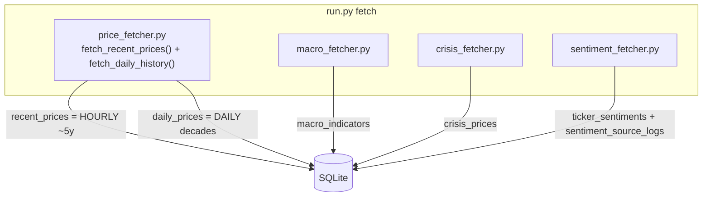
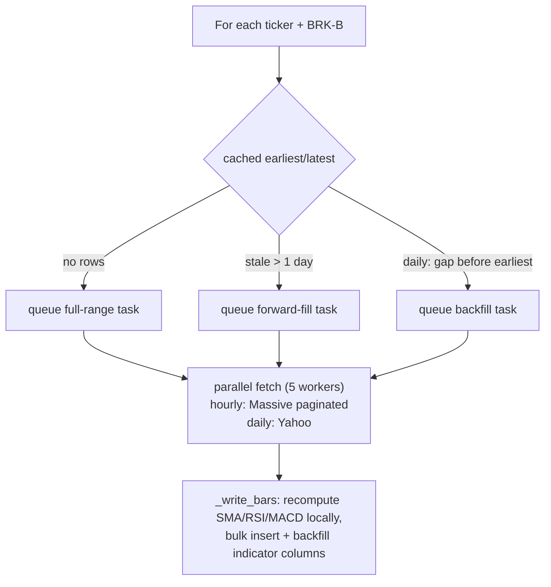
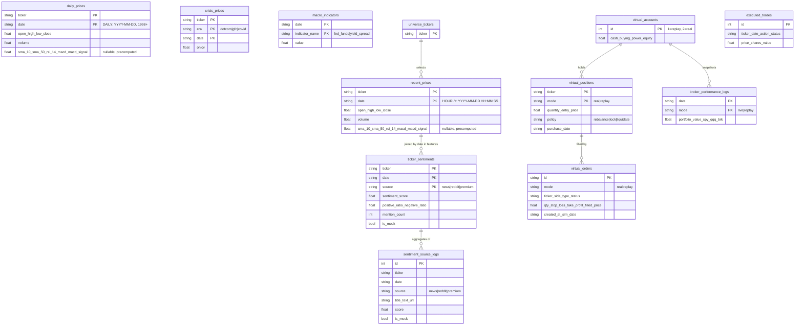

# Data Pipeline & Storage

`run.py fetch` runs the ingestion scripts sequentially. All write into the shared SQLite DB.

> **Two clean, never-mixed price tables** (changed 2026-06-15): `recent_prices` is now **hourly-only**
> from Massive/Polygon over the plan's ~5-year window; `daily_prices` is the **full multi-decade daily**
> history from Yahoo. This replaces the old single mixed table. See §2.

## 1. Sources actually used (≠ the README/design docs)

> The original design docs say **yfinance + FRED + NewsAPI/Reddit**. The *running* code is different.
> This matters because the headline data source ("Massive") is the primary path and is keyed.

> **"Massive" is Polygon.io.** The `/v2/aggs/...`, `/v2/reference/news`, Bearer auth and `next_url`
> pagination are the Polygon API; 403s link to `polygon.io/pricing`. The account is a **~5-year**
> entitlement — hourly *and* daily requests before ~2021-09 return `403 NOT_AUTHORIZED`, and Polygon has
> **no intraday history before ~2003** at any tier. That is why pre-2021 history can only come from Yahoo,
> and **dot-com-era hourly data does not exist to be bought**.

| Data | Script | Real source in code | Resolution / range |
| :-- | :-- | :-- | :-- |
| Hourly prices (`recent_prices`) | `price_fetcher.fetch_recent_prices` | **Massive/Polygon** `/v2/aggs/.../hour/...`, paginated via `next_url` | **Hourly**, ~last 4.6y (`HOURLY_LOOKBACK_DAYS=1700`) |
| Daily prices (`daily_prices`) | `price_fetcher.fetch_daily_history` | **Yahoo Finance** chart API (daily) | **Daily**, `DAILY_HISTORY_START=1998`→today, survivors only |
| Macro | `macro_fetcher.py` | **Massive API** `/fed/v1/treasury-yields` (not FRED) | Daily, 1996→today |
| Crisis eras | `crisis_fetcher.py` | **yfinance** | Daily; dotcom / gfc / covid (per `crisis_universes.yaml`) |
| News sentiment | `sentiment_fetcher.py` | Massive news → else NewsAPI → else Finnhub → else **mock** | Per-day, last 2 days |
| Reddit sentiment | `sentiment_fetcher.py` | PRAW (`r/wallstreetbets`, `r/stocks`) → else **mock** | Per-day, last 2 days |
| Premium | `sentiment_fetcher.py` + `/api/sentiment/premium` | Local files in `data/premium_news/` + manual UI paste | On demand |

`macro_fetcher` derives two series: `fed_funds` (proxied by the **3-month treasury yield**) and
`yield_spread` (`10y − 2y`).

## 2. Resolution: fixed (data layer) — two clean tables

**History:** the DB *used* to hold one `recent_prices` table mixing Yahoo **daily** bars (pre-2022) with
Massive **hourly** bars (post-2022). Because every feature window in `features.py` is **row-based**,
`sma_50` meant 50 days on old rows and 50 hours on new rows, and the "3-day" target was really "3-hour" on
recent data — the model trained on inconsistent semantics. This was the top correctness bug.

**Now (2026-06-15):** prices are split into two single-resolution tables that are **never mixed**:

| Table | Resolution | Range | Source | Used by |
| :-- | :-- | :-- | :-- | :-- |
| `recent_prices` | **Hourly** | ~4.6y (back to ~2021-10) | Massive/Polygon, paginated | Short-term models, virtual broker, sim/replay |
| `daily_prices` | **Daily** | 1998 → today (survivors) | Yahoo | Long-term / regime models, long-horizon benchmarks *(wiring = Phase 2)* |

Coverage after the rebuild: `daily_prices` ≈ 182k rows, 29 tickers, 1998-01-02 → today (recent IPOs start
at their listing date: ARM 2023, PLTR 2020, META 2012, AVGO 2009, GOOGL 2004); `recent_prices` clean
hourly for all 29 tickers + the `BRK-B` benchmark (fetched from Massive as `BRK.B`).

> **Completed (Stage 18 — ML rewiring):** HMM regime classification and the daily MPT portfolio rebalancing optimizer now strictly load pricing history from the `daily_prices` database table, completely separating the daily and hourly data feeds. Feature engineering has been updated with stationary indicators to eliminate price-level drift.

## 3. Incremental fetch & rate-limit protection

`price_fetcher` is incremental and parallel (`ThreadPoolExecutor`, 5 workers):

The hourly fetch additionally **purges legacy rows** once (any Yahoo-daily-stamped or pre-window rows) for
a clean rebuild, and drops rows for tickers no longer in the universe.

- Technical indicators (`sma_10/50`, `rsi_14`, `macd`, `macd_signal`) are **recomputed locally** in the
  fetcher and stored on `recent_prices` (then re-derived again in `features.py`).
- Sentiment fetch **skips external APIs** if ≥ 40 non-premium rows already exist for a date (free-tier
  protection). With no keys it falls back to `generate_mock_sentiment` (seeded plausible scores + fake
  source logs marked `is_mock=1`).
- Retries use exponential backoff on HTTP 429.

## 4. Database schema (ERD)

SQLAlchemy models in `app/database/models.py`. SQLite, auto-migrated on `init_db()`.

Notes:
- `recent_prices.date` is a **string** `YYYY-MM-DD HH:MM:SS` (hourly); `daily_prices.date` is
  `YYYY-MM-DD`. Both are parsed with `pd.to_datetime(..., format='mixed')` throughout.
- Two virtual accounts exist by design: **id 2 = `real`** (live-ish), **id 1 = `replay`/simulated**.
- `executed_trades` is written by the Alpaca/local executor; the virtual broker writes `virtual_orders`.
  These two trade ledgers are **not** unified.
- `init_db()` performs in-place ALTER/rebuild migrations (adds `mode`, `is_mock`, `purchase_date`,
  indicator columns) so older DBs keep working.
