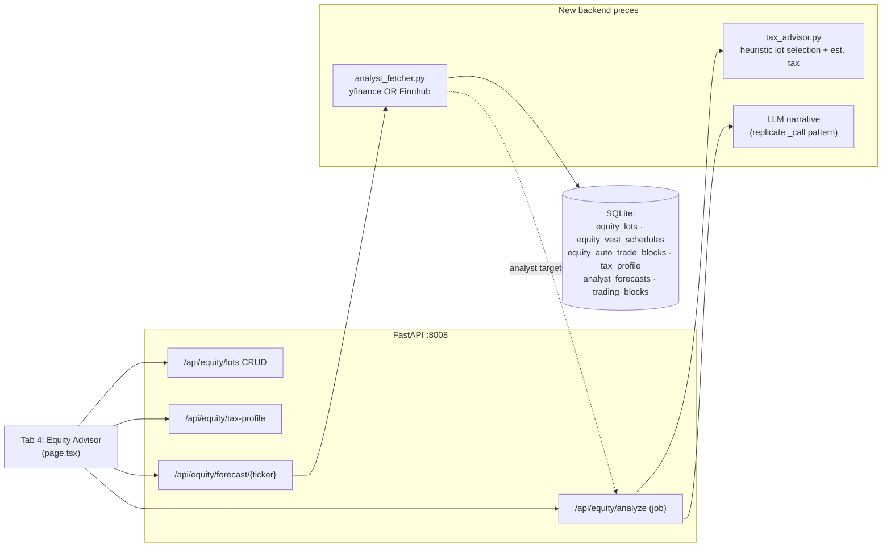

# Equity Advisor Tab (Tax-Aware Sell Planner)

A self-contained, advisory-only module for personally-held vested employee shares (e.g. PINS, ADBE)
held in an external brokerage. You enter your lots and tax situation; the system shows the latest
available analyst forecasts (best-effort, delayed) and computes a **tax-aware** sell plan using a
deterministic heuristic and **approximate, configurable** capital-gains estimates. It does not place
trades and does not touch the Alpaca/execution path.

> **Decision-support only, not tax advice.** All tax constants are approximations that must be verified
> against the real tax year; analyst data is delayed/best-effort and may be missing.

## Data flow

## 0. Prerequisite spike (do this first)

Verify, against the version actually installed in the worktree venv, what analyst data is reliably
retrievable before committing to a data source:

- Test `yf.Ticker("ADBE").info` for
  `targetMeanPrice/targetHighPrice/targetLowPrice/targetMedianPrice/numberOfAnalystOpinions/recommendationMean/recommendationKey/currentPrice`,
  and inspect what `.recommendations` actually returns in this version (its shape is version-dependent).
- If yfinance fields are empty/throttled, use **Finnhub** (`FINNHUB_API_KEY` already in config)
  recommendation-trend + price-target endpoints.
- Pick the data source based on this spike's result. Treat field availability as uncertain.

## 1. Database (new tables in `backend/app/database/models.py`)

Auto-created by `create_all` in `init_db()` (`backend/app/database/connection.py`); new tables need no
migration shim (that shim is only for altering existing tables). Add to
`backend/app/database/__init__.py` if referenced elsewhere.

- `EquityLot` (`equity_lots`): `id` PK autoinc, `ticker`, `account_label`, `lot_type`
  (`rsu`/`espp`/`other`), `shares`, `cost_basis_per_share`, `acquisition_date` (ISO),
  `notes`, `created_at`. One row per tax lot (vs. `virtual_positions`' one-row-per-ticker).
- `TaxProfile` (`tax_profile`): single row — `filing_status`, `ordinary_income`, `magi` (for the NIIT
  test), `state_ltcg_rate`, `state_stcg_rate`, `carryover_loss`, `tax_year`.
- `AnalystForecast` (`ticker_analyst_forecasts`, PK `(ticker, as_of_date)`): `current_price`,
  `target_mean/high/low/median`, `num_analysts`, `recommendation_mean`, `recommendation_key`,
  optional `strong_buy/buy/hold/sell/strong_sell`, `upside_pct`, `source`. All analyst fields are
  nullable — downstream must treat them as possibly absent.
- `EquityVestSchedule` (`equity_vest_schedules`, PK `(ticker, lot_type)`): cadence, vest day/months,
  `next_vest_date`, `est_shares`, `vesting_complete`, `notes`, `updated_at`.
- `EquityAutoTradeBlock` (`equity_auto_trade_blocks`, PK `ticker`): `blocked`, `updated_at` — whether
  the bot may auto-trade that externally held name (syncs to `trading_blocks`).

**Persistence:** Equity Advisor data lives only in SQLite (`backend/data/trading_system.db`), not in git.
Repo cleanup (`make clean-cache`, fresh clone) does not touch it. Run `make backup` (Google Drive) to
protect against accidental DB deletion; restore with `make restore` or `make restore-commit`.

## 2. Analyst forecast fetcher (new `backend/data_ingestion/analyst_fetcher.py`)

Implement the source chosen in the spike (yfinance and/or Finnhub). Upsert a snapshot keyed on the
fetch date; on failure/throttle, return the last cached row. Record which `source` produced each row.
Do not assume any field is populated.

## 3. Tax engine (new `backend/ml_engine/tax_advisor.py`)

Pure-Python heuristic, no ML, no claim of optimality.

- `classify_lots(lots, as_of)` -> per lot: unrealized gain/loss, holding period,
  `is_long_term` (held > 365 days), `days_to_long_term`.
- **Tax constants are verify-before-use and configurable per `tax_year`**: federal LTCG 0/15/20%
  thresholds by filing status, and ordinary brackets for short-term gains. NIIT 3.8% is applied **only**
  when MAGI exceeds the filing-status threshold and net investment gain is positive. State is handled as
  a user-entered flat rate. The combined rate is a labeled **approximation**, not a precise effective
  rate (it ignores SALT/federal-deductibility interactions, AMT, etc.).
- `estimated_tax_on_sale(lot, profile)` -> estimated tax owed (or benefit, if a loss), splitting LT vs ST.
- `recommend_sale(lots, profile, objective, long_term_grace_days)` — objective in {raise target cash,
  harvest target loss, exit a ticker}. Heuristic order: realize losses first (largest loss/share), then
  HIFO among gains, prefer long-term lots, and flag lots with
  `days_to_long_term < long_term_grace_days` as "wait to qualify for LTCG." Returns ordered picks +
  proceeds + estimated tax + net cash. Explicitly a heuristic, not an optimizer.
- `wash_sale_flags(lots, sales)` -> warn when a loss sale falls within the **61-day window (30 days
  before or after the sale)** of any same-ticker acquisition (relevant with ongoing ESPP/RSU vesting).
- `annual_plan(lots, profile)` -> multi-year tranche schedule using the $3,000/yr
  capital-loss-vs-ordinary-income offset and carryforward, LTCG bracket ceilings, and short-term-lot
  maturation. Returns a per-year table.

## 4. API endpoints (in `backend/app/main.py`)

Mirror the `/api/holdings` CRUD shape (Pydantic + `Depends(get_db)` + upsert/commit) and the
`_job_new` + thread + `/result?job_id` background-job pattern (as used by `/api/evaluate`).

- `GET/POST /api/equity/lots`, `DELETE /api/equity/lots/{id}`.
- `GET/POST /api/equity/tax-profile`.
- `GET /api/equity/forecast/{ticker}` — cached, refresh if stale (> 1 day).
- `POST /api/equity/analyze` `{objective, target_amount}` -> job: refresh forecasts for held tickers,
  run `tax_advisor`, and (when an LLM is available) generate a narrative by **replicating** the `_call`
  pattern from `backend/ml_engine/fundamental_llm.py`. The LLM is constrained to *narrate only the
  already-computed figures* — it must not introduce tax rules or numbers. Results are returned via
  `GET /api/equity/analyze/result?job_id` (held in the in-process job registry; not persisted to a table).

## 5. Frontend — Tab 4 (in `frontend/src/app/page.tsx`)

Re-locate anchors by string (line numbers below are approximate, from one read of a file that changes):

- Extend the `activeTab` union (~line 110) with `'advisor'`.
- Add a fourth `toggle-btn` "Equity Advisor" to the toggle group (~lines 1017-1038).
- Add `{activeTab === 'advisor' && (...)}` before `</main>` (~line 3031), using `glass-card`/`trade-table`
  styling + a lucide icon, with panels:
  - **Tax Profile** (filing status, income, MAGI, state rates, carryover loss, tax year).
  - **My Share Lots** (CRUD; live price, market value, unrealized P&L $/%, LT/ST badge per lot).
  - **Analyst Forecast** per held ticker (targets, % upside, analyst count, rating — each rendered only
    when the field is present).
  - **Sell Plan** (objective + target -> `/api/equity/analyze` with job-poll; shows recommended lots,
    estimated tax, net proceeds, scenario comparison, multi-year table, wash-sale warnings, the
    narrative, and a disclaimer).

## 6. Optional plumbing

`run.py fetch-forecasts` + `make fetch-forecasts` (`backend/run.py`, `Makefile`) following the existing
`cd backend && $(VENV_PY) run.py <action>` pattern, for manual/cron forecast refresh.

## Notes / assumptions

- Advisory only; no orders placed; PINS/ADBE need not be in the trading universe.
- All tax constants are approximations that must be verified against the real tax year; state tax is a
  flat user input; the combined rate is an estimate.
- Analyst data is delayed/best-effort and may be missing.
- **Decision-support, not tax advice — must be surfaced in the UI.**

## Implementation order (suggested)

1. Spike the analyst data source (Section 0).
2. Add the three DB models (Section 1).
3. Build the analyst fetcher against the chosen source (Section 2).
4. Build the tax engine with verified constants (Section 3).
5. Wire the API endpoints (Section 4).
6. Build the frontend tab (Section 5).
7. Optional CLI/Make plumbing (Section 6).
