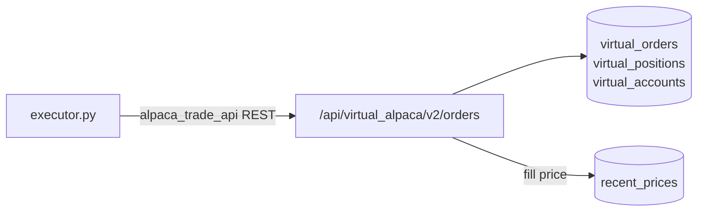
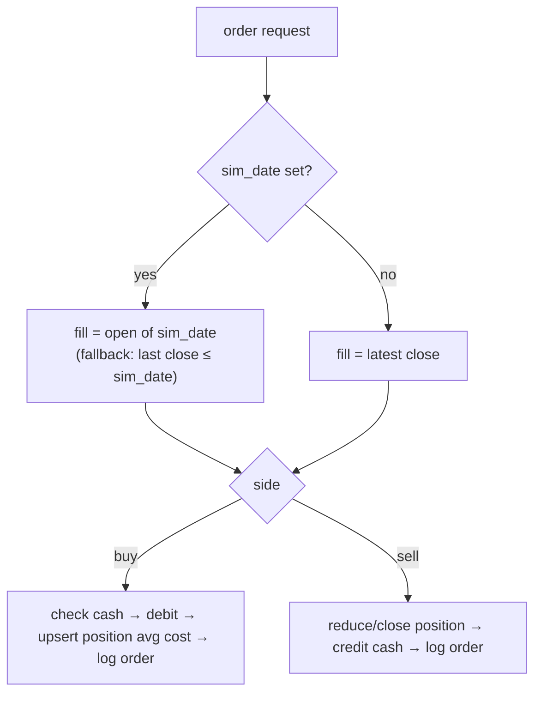
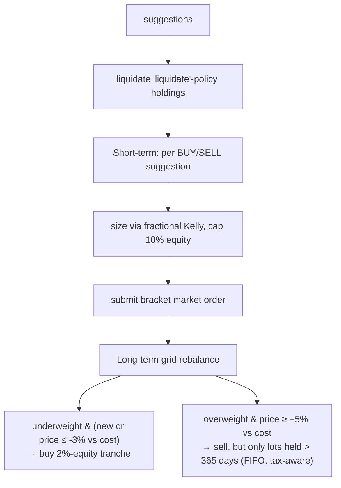

# Execution, Virtual Broker & Simulation

There are **three distinct ways** the bot "trades", and they are easy to confuse:

| Mechanism | Code | Account / data | Fills | Purpose |
| :-- | :-- | :-- | :-- | :-- |
| **PyBroker backtest** | `backtesting/backtest.py` (`run.py backtest`) | in-memory, $100k | next-bar, 0.05% fee | Theoretical strategy audit, incl. crisis eras |
| **Forward simulation** | `simulator.run_forward_simulation` (`simulate --days N`) | virtual account **1** (`replay`/`live` logs) | open of each of last N cached days | "Watch it trade" on recent data |
| **Historical replay** | `simulator.run_historical_replay` (`backtest-virtual --months N`) | virtual account **1**, reset to $100k | open of day T | Look-ahead-free walk-forward through the virtual broker |
| **Live/paper execution** | `executor.run_execution` (scheduler) | virtual account **2** (`real`) or real Alpaca | market/bracket | Actual (paper) order placement |

## 1. The Virtual Alpaca broker

`app/main.py` implements a subset of the Alpaca REST API under `/api/virtual_alpaca/v2/*`
(`account`, `positions`, `orders`, `DELETE positions/{symbol}`), backed by SQLite. The executor uses the
**real `alpaca_trade_api` client** pointed at `localhost:8008`, so swapping in real Alpaca later is just a
credentials/URL change (`get_alpaca_api`).



**Modes & accounts** — the most confusing part of the system:
- `mode=real` → `VirtualAccount.id=2`, positions `mode='real'`.
- `mode=simulated`/`replay` → `VirtualAccount.id=1`, positions `mode='replay'`.
- A **global file** `backend/data/sim_date.txt` holds the "current simulation date". If non-empty, **every**
  broker endpoint switches into `replay` mode and fills at that date's prices — regardless of the `mode`
  query param. The simulator sets it at the start of a run and clears it (`""`) at the end.

> ⚠️ **Global-state caveat:** because `sim_date.txt` is process-wide, a replay/simulation running against
> the same server will make the live dashboard show replay data for the duration. Don't run a long replay
> while expecting the dashboard to reflect "today". A crash mid-run can leave `sim_date.txt` non-empty
> and strand the server in replay mode (fix: empty the file).

## 2. Order fill logic (`POST /api/virtual_alpaca/v2/orders`)



Bracket stop/take-profit prices are stored on the `virtual_orders` row but **not actively monitored
intraday** by the broker — they're evaluated once per day by `evaluate_virtual_broker_daily`.

## 3. Daily evaluation & stops (`executor.evaluate_virtual_broker_daily`)

For each open position on `sim_date`:
1. Find its latest filled buy order with a stop/target.
2. If `low ≤ stop_loss` → fill at stop; elif `high ≥ take_profit` → fill at target; sell the position.
3. Mark-to-market the account at the day's close; write a `broker_performance_logs` row with portfolio,
   SPY, QQQ, BRK-B closes (the dashboard's equity curve).

## 4. The two trading strategies inside the executor

`execute_alpaca_live_paper_trade` runs both, in order:



- **Short-term**: skips tickers already held or `lock`-policy; whole shares only on live path.
- **Long-term grid**: only acts on `rebalance`-policy holdings; buys in capped 2%-of-equity tranches when
  underweight and price dipped ≥3% below cost; sells only **long-term (>365 day) FIFO lots** when up ≥5%.
  Holding-period accounting in `get_long_term_available_shares` reconstructs lots from `virtual_orders`.

## 5. Replay vs forward simulation

```mermaid
flowchart LR
    subgraph replay["backtest-virtual --months N"]
        R1[reset replay acct to $100k] --> R2[clear replay positions/orders/logs]
        R2 --> R3[loop SPY bars since N months ago]
        R3 --> R4[suggest@T-1 → fill@open T → eval stops@close T]
    end
    subgraph fwd["simulate --days N"]
        F1[keep account as-is] --> F2[loop last N SPY bars]
        F2 --> F3[suggest@T-1 → fill@open T → eval@close T, mode=live]
    end
```

> ⚠️ Both loops iterate over **distinct `recent_prices.date` values for SPY**. Because post-2022 data is
> **hourly**, "trading days" is actually "trading **hours**" — a "6-month replay" steps through thousands
> of hourly bars, and per-bar logic (3-row targets, "next-day open", 365-day holding checks) is applied at
> hourly cadence. The `broker_performance_logs` confirm this (replay dates like `2026-06-05 12:00:00`).
> This is a direct consequence of the resolution issue in [data-pipeline.md §2](./data-pipeline.md#2-️-the-critical-data-quality-issue-mixed-resolution).

## 6. PyBroker backtest (`backtesting/backtest.py`)

Separate, self-contained audit. Builds features, runs XGBoost/PyTorch inference per ticker, then:
- **Short-term**: PyBroker strategy — buy on `prob ≥ 0.55` at 10% target size with ATR-based stop/target,
  time-stop after 3 bars. Prints total return, Sharpe, max drawdown, win rate, trade count.
- **Long-term**: manual monthly-rebalanced MPT loop (252-row window, 0.5× weights in crisis). Prints
  total return, Sharpe, max drawdown.
- `--era dotcom|gfc|covid|recent` selects `crisis_prices` vs `recent_prices`.

This backtest path is the **only place that prints performance metrics on held-out-ish history**, so it's
your main lever for judging whether the models do anything — but note crisis-era data has **no sentiment**
(price/macro only) and `recent` shares the mixed-resolution problem.

## 7. Real Alpaca path & reconciliation

If `ALPACA_API_KEY`/`SECRET` are set, `get_alpaca_api` targets real paper Alpaca instead of the virtual
broker. `run_execution` then: authenticates → `sync_broker_orders` + `sync_broker_positions` (reconciles
SQLite ↔ broker, creating synthetic FIFO orders for drift, syncing cash) → places trades → re-syncs.
`/api/reconcile` triggers this on demand. This path is wired but **untested without real keys** (none
present in the inspected env).
