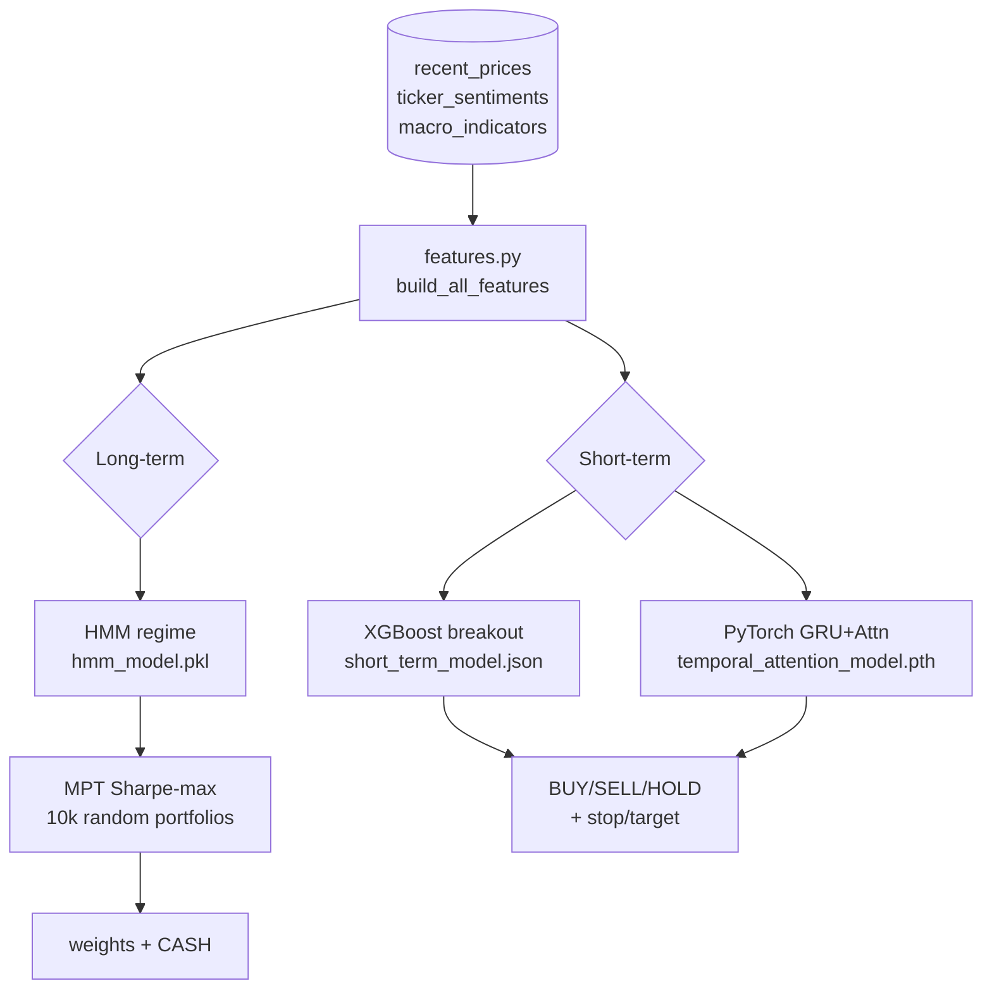
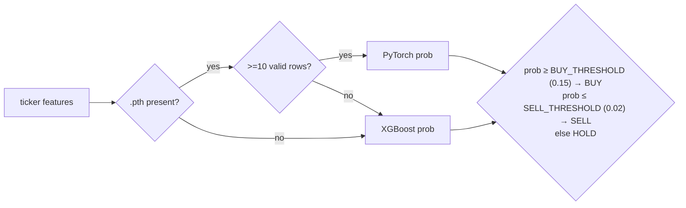
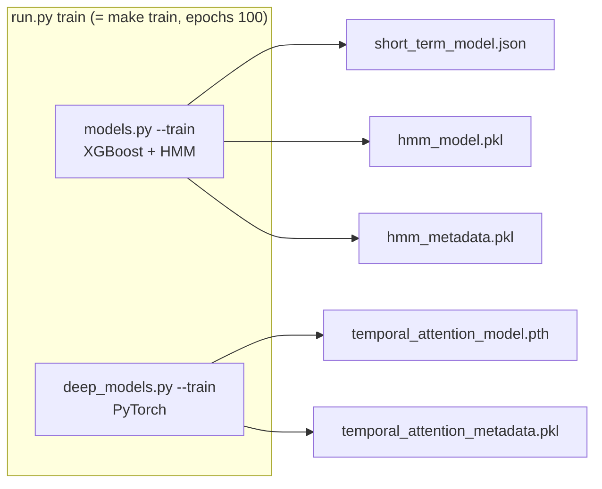

# ML Models & Strategy Logic

The bot produces two outputs every time `/api/suggestions` is called:
1. **Short-term suggestions** — per-ticker BUY/SELL/HOLD breakout calls.
2. **Long-term allocation** — portfolio weights under the current market regime.

## 1. Feature engineering (`ml_engine/features.py`)

`build_all_features(prices, sentiment, macro, universe)`:
1. Per ticker (needs ≥ 50 rows): `build_features_for_df()` computes technicals, merges sentiment & macro,
   builds the target, then **shifts every feature by 1 row** (look-ahead mitigation) into `feat_*` columns.
2. Concatenate all tickers, then `add_cross_ticker_features()` adds SPY/QQQ-relative features.

**Feature groups** (all emitted as `feat_*`, all shift(1)):

| Group | Features |
| :-- | :-- |
| Price / trend | `returns`, `volatility_10`, `sma_10`, `sma_50`, `ma_ratio`, `open/high/low/close`, `volume` |
| Momentum | `rsi_14`, `macd`, `macd_signal`, `bb_mid/std/width`, `atr_14` |
| Sentiment | `news_sentiment_score`, `reddit_sentiment_score`, `news/reddit_mention_count`, `combined_sentiment` (0.6·news+0.4·reddit), `sent_sma_3`, `sent_sma_7`, `sent_momentum` |
| Macro | `fed_funds`, `yield_spread` |
| Cross-ticker | `relative_return_spy/qqq`, `relative_vol_spy/qqq`, `cum_rel_ret_spy_50`, `rank_return`, `rank_volatility`, `corr_spy_20`, `corr_qqq_20` |

**Target (`target_win`) — triple-barrier:** `1` only if, within `SHORT_TERM_HORIZON_BARS` (14) bars, the
**take-profit is touched before the stop** (path-dependent, intrabar high/low); `0` if the stop hits first
or neither does (timeout); same-bar ambiguity is scored conservatively as a loss; NaN on the censored tail.
Brackets are ATR-based (`stop = clip(2·ATR/close, 1.5%, 5%)`, `tp = 2.5·stop`) — the **same `config.py`
params used for live orders and the backtest time-stop**, so the label equals the trade as executed. This
replaced the old "did the high touch +2%" breakout target, which scored a volatility *touch* (inflated AUC
0.925) rather than an exitable trade. Judged by **walk-forward** (`run.py walkforward`), the triple-barrier
model shows a **small but real out-of-sample edge in the confident tail** (+0.27%/trade net at the 0.15
threshold, pooled AUC 0.689) — break-even below that and decaying in the latest fold — see
[current-state-and-gaps.md §1b](./current-state-and-gaps.md#1b-validation-results).

**Entry threshold:** `prob ≥ SHORT_TERM_BUY_THRESHOLD` (0.15), not 0.55 — the ~5% base rate keeps calibrated
probabilities small. Config-driven so it can be tuned against the backtest.

**Sentiment & macro join (fixed):** `build_features_for_df` derives `cal_date = date[:10]` and joins
daily-grained news/macro on it, so a day's sentiment/macro broadcasts across all of that day's hourly bars
(previously the join silently failed and these features were always 0). Mock rows are excluded from
training. Sentiment is a **short-term-only** input; the long-term/regime model is price+macro.

> **Resolution (Phase 2 — done):** short-term features/targets run on hourly `recent_prices` with a
> bar-aware horizon; the regime + MPT long-term path now reads daily `daily_prices`. The execution/replay
> layer still steps per hourly bar with some day-named units (G6) — tracked in
> [current-state-and-gaps.md](./current-state-and-gaps.md).

## 2. Short-term model A — XGBoost (`models.py`)

- `XGBClassifier(n_estimators=100, max_depth=4, lr=0.05, subsample=0.8, colsample_bytree=0.8)`.
- Trained on all `feat_*` columns (hourly `recent_prices` + real sentiment + macro) vs `target_breakout`.
- **Sample weights = exponential temporal decay**, 5-year half-life (recent rows weigh more).
- **Out-of-sample eval**: a time-ordered 80/20 split prints ROC-AUC + precision@BUY before the production
  model is refit on all data.
- Saved to `ml_engine/saved_models/short_term_model.json`.

## 3. Short-term model B — PyTorch Temporal Attention (`deep_models.py`)

- `LightTemporalAttentionNet`: GRU (hidden 32) → scaled dot-product self-attention → mean-pool → sigmoid.
- Input = sequences of **10 consecutive rows** per ticker; features standardized with mean/std saved to
  `temporal_attention_metadata.pkl`.
- Same 5-year temporal-decay sample weights; `BCELoss`, Adam lr 0.005, default 30 epochs (Makefile uses 100).
- Saved to `temporal_attention_model.pth`.

**Inference precedence in `/api/suggestions`:** if a `.pth` + metadata exist → use PyTorch; if a ticker
has < 10 valid rows, fall back to XGBoost for that ticker; if no PyTorch at all → XGBoost. Both output a
single probability `prob ∈ [0,1]`.

## 4. Long-term model — HMM regime + MPT (`models.py`)

**Regime (HMM):** `GaussianHMM(n_components=3, covariance_type="diag")` fit on **daily** SPY
`[feat_volatility_10, feat_fed_funds, feat_yield_spread]` from `daily_prices` (multi-decade, 1998→ — so the
regime model now actually sees real bull/bear/crisis history incl. dot-com & 2008, not 5 years of hourly).
The 3 states are sorted by mean volatility and mapped → `growth` (lowest) / `transition` / `crisis`
(highest). Saved to `hmm_model.pkl` + `hmm_metadata.pkl`. At inference the **last daily SPY row** sets the
current regime.

**Allocation (MPT):** `PortfolioOptimizer.calculate_optimal_weights(daily_returns[-252:], regime)` — now
fed **daily** returns (≈1 trading year), not hourly:
- Expected returns = annualized mean; covariance = **Ledoit-Wolf shrinkage**, annualized.
- "Optimizer" = generate **10,000 random long-only weight vectors** (each clipped to ≤ 25% per name),
  keep the highest Sharpe (rf = 4%). This is a Monte-Carlo search, **not** a quadratic solver — results
  are noise-seeded (fixed `rng(42)`) and approximate.
- In `crisis` regime the API halves all weights (→ ~50% cash) via `regime_scalar`.

> The README mentions crisis-era Ledoit-Wolf covariance from GFC/Dot-Com data. The **live API path**
> (`app/main.py`) does **not** swap in crisis covariance — it just uses recent 252-row returns and scales
> weights by 0.5 in crisis. Crisis data is only loaded by the separate `backtest.py` era runs.

## 5. Position sizing — Fractional Kelly (`models.py`)

Used by the **executor**, not the suggestions endpoint:
- `f* = (b·p − q)/b`, clipped to [0,1], then × fraction. `p` = model confidence, `b` = payoff ratio
  (hard-coded 2.5), `fraction = 0.2` (so ~1/5-Kelly).
- Final trade value = `min(10% of equity, equity·f*)`; skipped if < $100.

## 6. Training & artifacts

All artifacts live in `backend/ml_engine/saved_models/` and are committed to the repo.

> **Held-out evaluation:** `train_models` now prints an out-of-sample ROC-AUC and precision@BUY from a
> time-ordered 80/20 split (XGBoost) before refitting on all data. PyTorch still reports in-sample
> loss/accuracy. For full strategy P&L, also run `run.py backtest` (PyBroker) — see
> [execution-and-simulation.md](./execution-and-simulation.md). Surfacing these metrics in the UI is still open.
