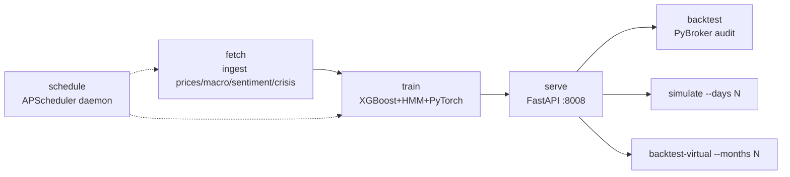

# Operations & Runbook

## 1. Setup

```bash
# Backend
cd backend
python3 -m venv venv && source venv/bin/activate
pip install -r requirements.txt

# Configure secrets (optional but needed for real data) — backend/.env
#   MASSIVE_API_KEY=...        # primary price/news/macro source (Polygon-compatible)
#   NEWS_API_KEY= / FINNHUB_API_KEY=   # news fallback
#   REDDIT_CLIENT_ID= / REDDIT_CLIENT_SECRET=
#   ALPACA_API_KEY= / ALPACA_SECRET_KEY=   # enables real paper trading

# Frontend
cd ../frontend && npm install
```

> **Data config (two clean tables):** `config.py` uses `DATA_TIMESPAN="hour"` for the **hourly**
> `recent_prices` table, fetched over the Massive/Polygon ~5-year window (`HOURLY_LOOKBACK_DAYS=1700`,
> ≈ back to 2021-10 — older requests 403). `fetch_daily_history` separately fills the **daily**
> `daily_prices` table from Yahoo since `DAILY_HISTORY_START=1998`. The two resolutions are never mixed.
> First `fetch` after upgrading auto-purges the old mixed `recent_prices` rows and rebuilds them cleanly.

## 2. Commands

Both `python run.py <cmd>` (from `backend/`) and `make <cmd>` (from repo root) work.



| Command | What it does | Cadence |
| :-- | :-- | :-- |
| `run.py fetch` | Prices + macro + crisis + sentiment into SQLite (incremental) | Daily pre-open |
| `run.py train [--epochs N]` | Train all models, write artifacts | Weekly / after changes |
| `run.py serve` | FastAPI on :8008 (`--reload`) | Always (with frontend) |
| `run.py backtest` | PyBroker short- + long-term metrics; `--era` for crisis | Audit (in-sample) |
| `run.py walkforward [--splits N]` | **Honest OOS eval**: expanding folds, win rate + net return by confidence percentile | The real edge check |
| `run.py calibrate` | Calibrate the served-model BUY threshold to a target selectivity → `threshold.json` | After train, or to re-tune |
| `run.py simulate --days N` | Forward sim on last N cached bars (account 1, `live` logs) | Ad hoc |
| `run.py backtest-virtual --months N` | Reset replay account, walk forward through virtual broker | Ad hoc |
| `run.py schedule` | Cron daemon (below) | Unattended only |
| `make serve` | Launches **both** backend (:8008) and frontend (:3002) | Dev |
| `make lint` | `backend/lint.py` whitespace/format cleanup | Pre-commit |

Frontend alone: `cd frontend && npm run dev -- -p 3002` → http://localhost:3002

## 3. Scheduler (`execution/scheduler.py`)

Optional `BlockingScheduler` (America/New_York):

| Job | Trigger | Action |
| :-- | :-- | :-- |
| Daily fetch | 09:00 ET | `fetch_recent_prices/macro/sentiment` |
| Daily inference | 09:15 ET | log-only (inference happens in executor) |
| Daily execution | 09:45 ET | `run_execution()` → suggestions → orders |
| Weekly retrain | Sun 18:00 ET | `train_models()` (XGBoost+HMM only; **not** PyTorch) |

`python execution/scheduler.py --test` runs one fetch→train→execute pass immediately for verification.

> Note: the weekly job calls `train_models()` directly, which retrains **only XGBoost + HMM**, not the
> PyTorch model. Since inference prefers the PyTorch `.pth` when present, scheduled retrains won't refresh
> the model that's actually serving unless you also run `deep_models.py --train`.

## 4. Typical first run

```bash
make fetch        # populate DB (slow on first run: backfills history)
make train        # train models (epochs 100)
make serve        # backend + frontend
# open http://localhost:3002, then in the Editor tab run a replay to populate the equity curve
```

## 5. Health checks / "is it doing anything?"

- DB populated? `sqlite3 backend/data/trading_system.db "select count(*) from recent_prices;"`
  (hourly) and `"select count(*), min(date), max(date) from daily_prices;"` (daily history).
- Models present? `ls backend/ml_engine/saved_models/` (need `.json`, `.pkl`×2, `.pth`, `.pkl`).
- Suggestions live? `curl 'localhost:8008/api/suggestions?mode=real' | jq '.regime, .short_term_suggestions[0]'`
- Is the server stuck in replay? Check `backend/data/sim_date.txt` is **empty**.
- Real vs mock sentiment? `sqlite3 ... "select source,sum(is_mock),count(*) from ticker_sentiments group by source;"`
  (in the inspected DB, reddit was **100% mock**, news partly mock).

## 5b. Hedging & alternative data

**Hedge overlay (long-short).** Off by default. Toggle in the dashboard ("Hedge overlay": None /
Beta-Neutral / Pair Trade), or per request: `GET /api/suggestions?hedge_mode=beta_neutral`. When on, each
BUY gets a **hedge leg** and an explicit `action_plan` string with exact long & short shares/prices — read
it straight off the dashboard to execute manually (e.g. Robinhood), or let the scheduler place it on Alpaca.
- `beta_neutral`: short SPY/QQQ (whichever the name tracks) sized by estimated beta.
- `pair_trade`: short a sector peer 1:1.
- **Live execution caveat:** the executor only places the hedge short on **real Alpaca** (set
  `ALPACA_API_KEY`/`SECRET` and `HEDGE_MODE=beta_neutral`); the built-in virtual broker can't short, so it
  logs a skip — use the on-screen trade plan to hedge manually there. Hedged backtest numbers are in-sample.

**Served model & BUY threshold.** `SERVED_MODEL` (default `xgboost`) decides which short-term model
serves and is calibrated against (set `pytorch` to opt into the deep model). The BUY threshold is **not** a
hand-set constant: `make calibrate` (auto-run by `make train`) writes `saved_models/threshold.json` with the
probability cutoff that yields `SHORT_TERM_SIGNAL_RATE` (default top 0.5%) on a held-out slice of the served
model, and reports the resulting OOS win-rate/net-return. Inference and the backtest read that file (falling
back to `SHORT_TERM_BUY_THRESHOLD` only if it's absent). This fixes the PR#2 issue where a single 0.23 number
was tuned on XGBoost yet a different model served. Selective by design — many days produce 0 BUYs.

**Alternative data (Congress/insider).** Off by default (`ALT_DATA_ENABLED=False`). The bundled fetcher
seeds **synthetic/random** disclosures (no signal) — for plumbing only. Do **not** enable for real trading
until a real source (SEC EDGAR Form 4 / Quiver STOCK Act) is wired in. See `pr2_review_and_updates.md` (C1).

## 6. Files & artifacts

```
backend/
  data/trading_system.db        # all data
  data/sim_date.txt             # replay flag (keep empty for live)
  data/premium_news/            # drop THEINFO_<TICKER>_*.txt here, then `fetch`
  ml_engine/saved_models/       # committed model artifacts
pybroker_cache/                 # PyBroker feature/result cache (gitignored)
```
